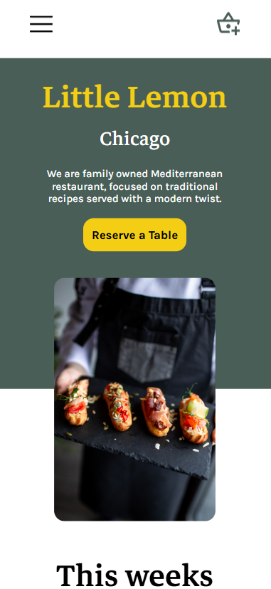
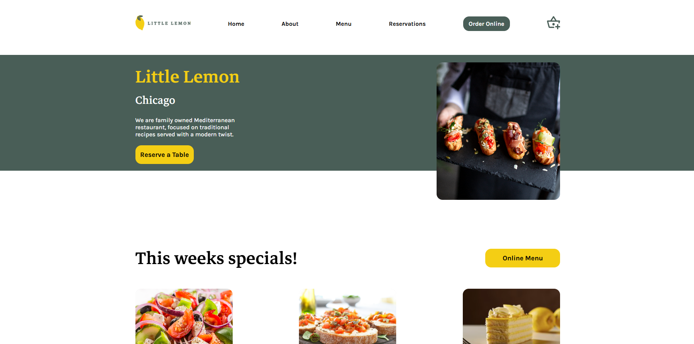

# Coursera Little Lemon

The **Little Lemon** app is the capstone project for **Meta's Front-End Developer Certificate** on Coursera.

---

## 📸 Screenshots

### 📱 Mobile View


### 💻 Desktop View


---

## 🚀 Technologies

This project was developed using the following technologies:

- **React JS**
- **TypeScript**
- **Styled Components**
- **Yup**
- **Formik**
- **Jest**
- **React Testing Library**
- **Git and GitHub**
- **Figma**

---

## 🛠️ Installation & Usage

### ✅ Prerequisites
Make sure you have the following installed on your machine:

- [Node.js](https://nodejs.org/) (LTS recommended)
- [npm](https://www.npmjs.com/) or [yarn](https://yarnpkg.com/)

### 📌 Steps to Run

1. **Clone the repository**
   ```sh
   git clone https://github.com/fonteeboa/coursera-little-lemon.git
   ```

2. **Navigate to the project directory**
   ```sh
   cd coursera-little-lemon
   ```

3. **Install dependencies**
   ```sh
   npm install
   ```

4. **Start the development server**
   ```sh
   npm start
   ```

5. **Access the application**
   ```
   http://localhost:5173/little-lemon
   ```

---

## 📜 License

This project is licensed under the **MIT License**.

